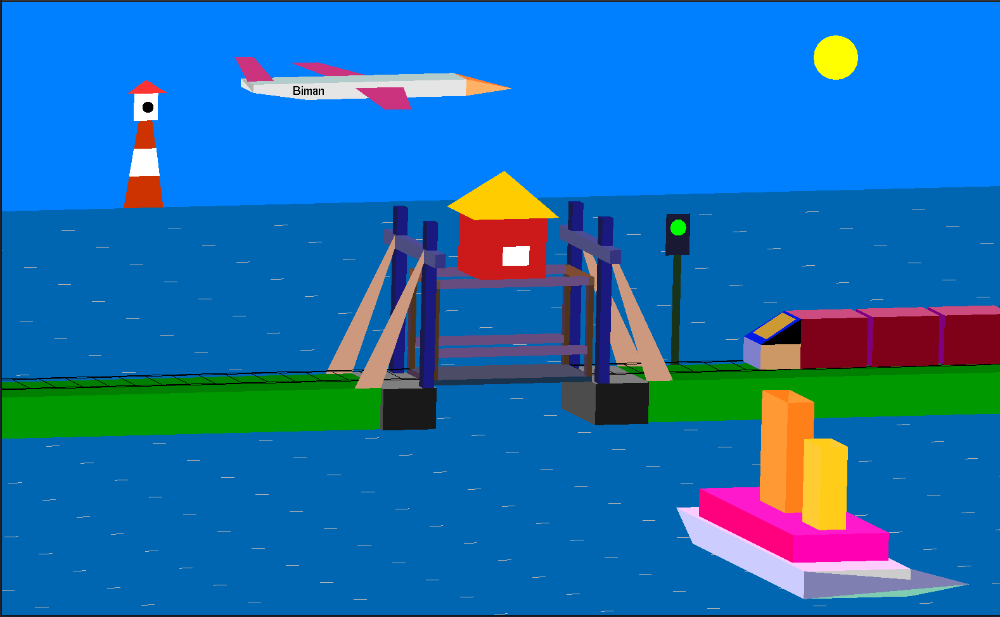
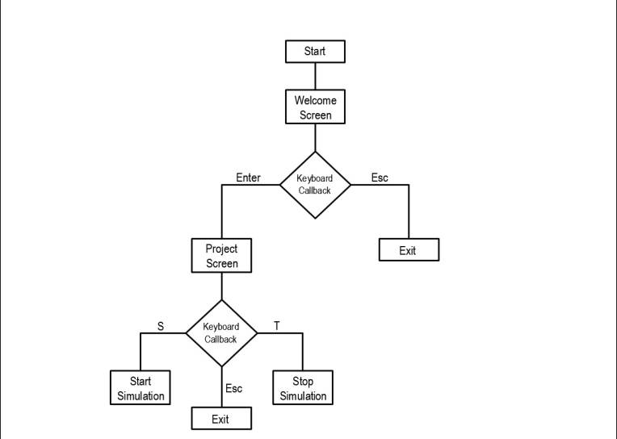

## Project: A mini project on vertical lift bridge simulation

To simulate a lift bridge, we drew a scene. The basic idea is the scene, over the bridge,a railroad track is placed. When there is no boat passing the water, the bridge need not be lifted, the signal light for the train is green and the train can pass over the bridge. If a boat needs to cross the river, the bridges need to be lifted and the signal light for the train has to turn red. Once it turns red, the passing train stops, the bridge is lifted, the boat passes and the bridge is drawn down again so that the light switches to green again and the train passes as usual. To add more realism in the scene, we also added an airplane that is flying in the sky. In order to make the project more user friendly, we also made a welcome screen which is revoked before the main project screen.

### Scene Description:
 - Welcome screen: a brief description of the project and some basic instructions are shown. 
- In the main project screen, we drew:
  -  A bridge
  -  Water
  -  Sky
  -  Earth
  -  Pillars
  -  Railroad Tracks
  -  A ship
  -  An airplane
  -  A lighthouse
  -  A passing signal light

### Methodology:

### Implementation:
We made several user defined functions to implement this project. Also, we took help from the GLUT API documentation version 3 and the OpenGL 2.1 reference documentation to use several glut library functions and gl library functions respectively. In this project, the functions can be divided into three categories:
  - OpenGL library function
  - User defined functions
  - Callback functions
  
#### OpenGL library functions:
The usage of the OpenGL library functions can be found in the GLUT API documentation version 3 and the OpenGL 2.1 reference documentation
section. So, we will mainly focus on the User defined functions and the Callback functions.

#### User Defined Functions:
  - setFont(void*); to set font type and size
  - drawstring(); to put written text in the screen using a font style
  - screen1(); to invoke the welcome screen with basic instructions
  - display(); to invoke the scene screen
  - water(); to draw the water in the background
  - lines(); to draw the lines on water as to simulate waves
  - earth(); to draw the ground
  - pillars(); to draw the pillars of the bridge which will not movebridge(); to draw the lift-bridge which will move
  - track(); to draw train tracks on the ground
  - ship(); to draw the ship which will move
  - train(); to draw the train which will move
  - aero(); to draw the airplane which will move
  - lighthouse(); to draw the lighthouse in the distant background
  - signal(); to draw the signal light post of the railroad track
  - light(); to draw the light bulbs on the signal light pose
  - translate_bridge(); to translate the bridge
  - translate_ship(); to translate the ship
  - translate_train(); to translate the train
  - translate_lines(); to translate the moving water lines
  - translate_aero(); to translate the airplane
  - update(int); to implement the train passing and bridge lifting logic
  
#### Callback functions:
  - mydisplay(); to be invoked as a callback by glutDisplayFunc()
  - reshape(); to be invoked as a callback function by glutReshapeFunc()
  - mykeyboard(); to be invoked as a callback function by glutKeyboardFunc()

#### Requrements:
- OpenGL/GLUT library
- IDE (vs code/codeblocks etc.)
- C++ Compiler

#### OS:
- Linux

#### Installing GLUT in linux:

- sudo apt update
- sudo apt install freeglut3 freeglut3-dev libglew1.5 libglew1.5-dev libglu1-mesa libglu1-mesa-dev libgl1-mesa-glx libgl1-mesa-dev mesa-common-dev libglew-dev libglfw3 libglfw3-dev libglm-dev

#### Running C++ files [ note: You have to add linkers]:
- g++ filename.cpp -o filename -lglut -lGL -lGLU -lGLEW
- ./filename
